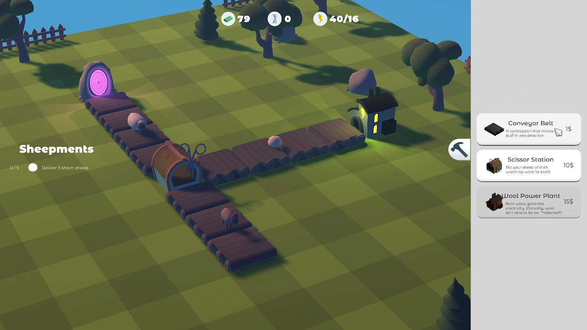
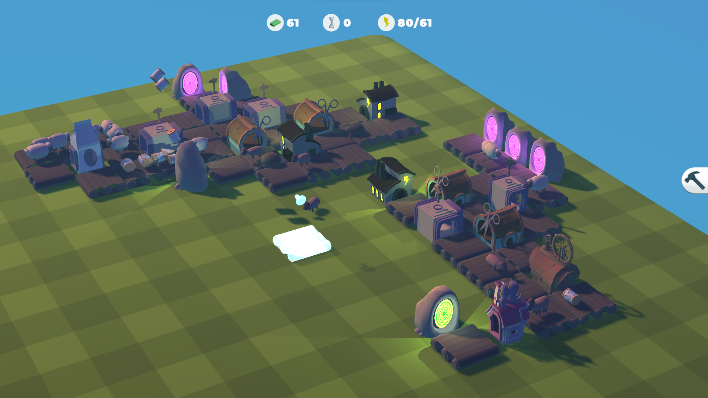

## Sheeping Logic Inc
An automation game similar to factorio, but here the player transports sheep over converyor belts. Made within one week at the GameDevWeek Trier 2023.

Trailer:

Links: [GitHub](https://github.com/GameDevWeek-2023/OFF_SheepingLogic) 
[itch.io](https://blendomatik.itch.io/sheeping-logic-inc)

### Features
* RTS-inspired building logic
* Completely handmade assets
* A vibrant environment and flair
* Usually ends in absolute chaos

### Gallery

    
    
    
    
    

## Bloom Boom
A card game played 1v1 via hotseat. The players use their cards to grow trees and beat the other player for light. Made within a month at the University of Augsburg.

Trailer:

Links: [itch.io](https://bloomboomstudios.itch.io/bloomboom)

### Features
* Procedural tree-growing logic inspired by [L-Systems](https://en.m.wikipedia.org/wiki/L-system), including user-defined growth rules
* Completely handmade assets including music

### Gallery
1 | 2 
:-------------------------:|:-------------------------:
  |  

## About me
Marvin :de:

[GitHub](https://github.com/marvin-sh) [YouTube]()

