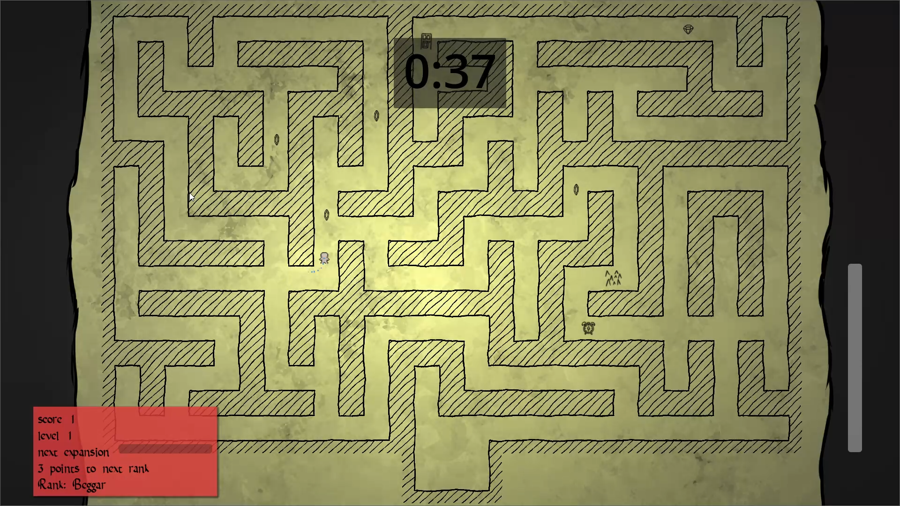
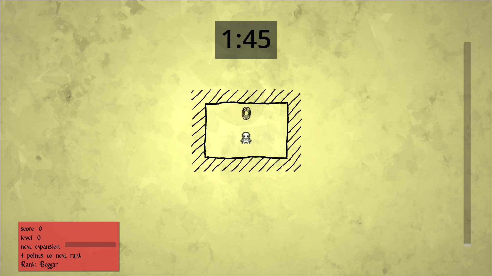

Hi! My name is Marvin, mathematician and programmer. Below I have listed some of the projects I worked on.

You can also find me here: &nbsp; [<i class="fab fa-github"></i> marvin-sh](https://github.com/marvin-sh) &nbsp; [<i class="fab fa-linkedin"></i> marvin-krauspenhaar](https://www.linkedin.com/in/marvin-krauspenhaar-463b72336/).  

## Scroll Maze
A 2D platformer game where you are trying to collect as many treasures as possible from an expanding maze, and also make your escape before time runs out. But the more treasures you collect, the further away the exit will be!

Made within one week at the GameDevWeek Trier 2025.

[<i class="fab fa-itch-io"></i> Itch.io](https://cedric-giese.itch.io/scroll-maze) &nbsp;

### Features
* Procedurally generated maze.
* Fluid character movement with speedrun potential.
* There are numerous artifacts to be found and traps to be avoided, worthy of a true adventurer.

[Davilu](https://www.youtube.com/@DaviluLP) has made a Let's Play of our game! Check it out here: [<i class="fab fa-youtube"></i> YouTube](https://www.youtube.com/watch?v=ZPNwxTl4yts).

### Gallery

<section class="container">
    

        

            
            
            
        

        

            
            
            
        

    

</section>

## Sheeping Logic Inc.
An automation game centered around sheep with a colorful 3D look. Made within one week at the GameDevWeek Trier 2023.

[<i class="fab fa-itch-io"></i> Itch.io](https://blendomatik.itch.io/sheeping-logic-inc) &nbsp; [<i class="fab fa-youtube"></i> YouTube](https://youtu.be/dSKOl-yFfmk) &nbsp; [<i class="fab fa-github"></i> GitHub](https://github.com/GameDevWeek-2023/OFF_SheepingLogic)  

### Features
* Extensive sheep-related production chains.
* Completely handmade assets.
* Usually ends in absolute chaos. Maah!

### Gallery

<section class="container">
    

        

            <iframe id="SL-slide0" src="https://www.youtube.com/embed/dSKOl-yFfmk"></iframe>
            
            
            
        

        

            
            
            
            
        

    

</section>

## Bloom Boom
A card battler in a 1 vs 1 hot seat setting, where both players try to grow
their own tree as high an possible and try to stop the other player from
doing so. Made within a month at the University of Augsburg.

[<i class="fab fa-itch-io"></i> Itch.io](https://bloomboomstudios.itch.io/bloomboom) &nbsp; [<i class="fab fa-youtube"></i> YouTube](https://youtu.be/Yg6f0jcUayk) 

### Features
* Procedural tree-growing logic inspired by [L-Systems](https://en.m.wikipedia.org/wiki/L-system).
* Custom game mode featuring user-defined growth rules.
* Completely handmade assets.

### Gallery

<section class="container">
    

        

            <iframe id="BB-slide0" src="https://www.youtube.com/embed/Yg6f0jcUayk"></iframe>
            
            
            
        

        

            
            
            
            
        

    

</section>

