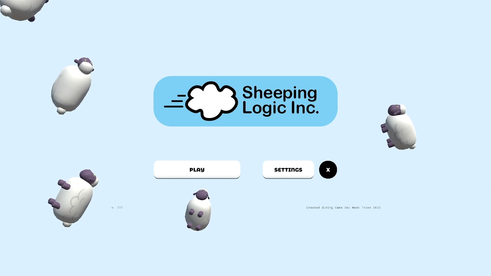

## Sheeping Logic Inc.
An automation game centered around sheep with a colorful 3D look. Made within one week at the GameDevWeek Trier 2023.

Trailer: [Youtube](https://youtu.be/dSKOl-yFfmk)

Links: [GitHub](https://github.com/GameDevWeek-2023/OFF_SheepingLogic) 
[itch.io](https://blendomatik.itch.io/sheeping-logic-inc)

### Features
* Extensive sheep-related production chains.
* Completely handmade assets.
* Usually ends in absolute chaos. Maah!

### Gallery

## Bloom Boom
A card battler in a 1 vs 1 hot seat setting, where both players try to grow
their own tree as high an possible and try to stop the other player from
doing so. Made within a month at the University of Augsburg.

Trailer: [Youtube](https://youtu.be/Yg6f0jcUayk)

Link: [itch.io](https://bloomboomstudios.itch.io/bloomboom)

### Features
* Procedural tree-growing logic inspired by [L-Systems](https://en.m.wikipedia.org/wiki/L-system).
* Custom game mode featuring user-defined growth rules.
* Completely handmade assets.

### Gallery

## About me
Marvin, video game programmer and mathematician. I also like surfing, climbing, and music.

